# Urumbu Crane

## Table of Contents <!-- omit from toc -->

- [Introduction](#introduction)
- [Design](#design)
- [Manufacturing](#manufacturing)
  - [3D Printing](#3d-printing)
  - [CNC Routing](#cnc-routing)
  - [Laser Cutting](#laser-cutting)
  - [Assembling](#assembling)
- [Demonstration](#demonstration)
- [Conclusion](#conclusion)

## Introduction

## Design

|  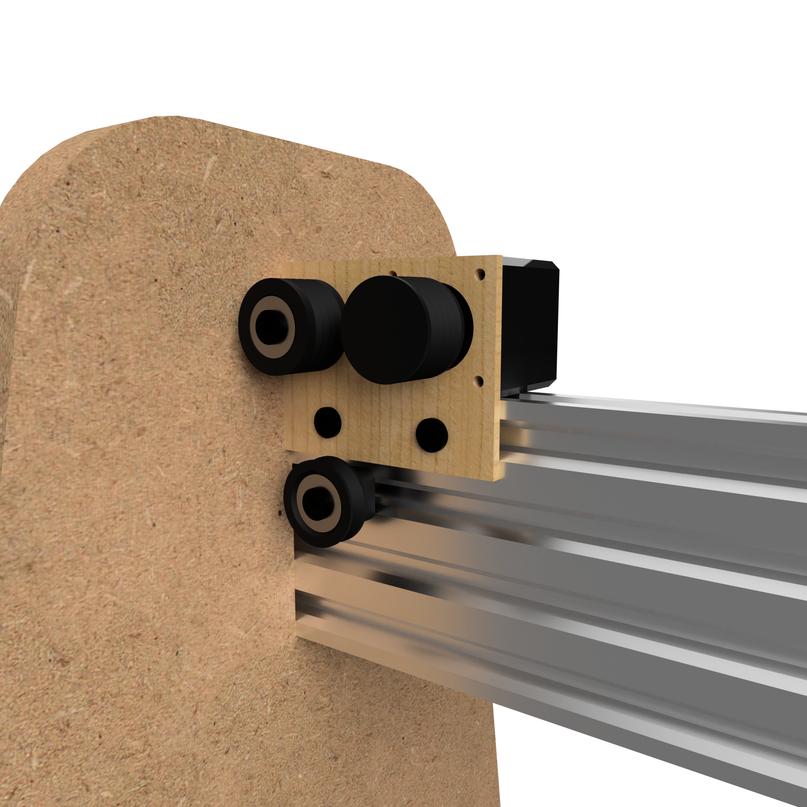 | 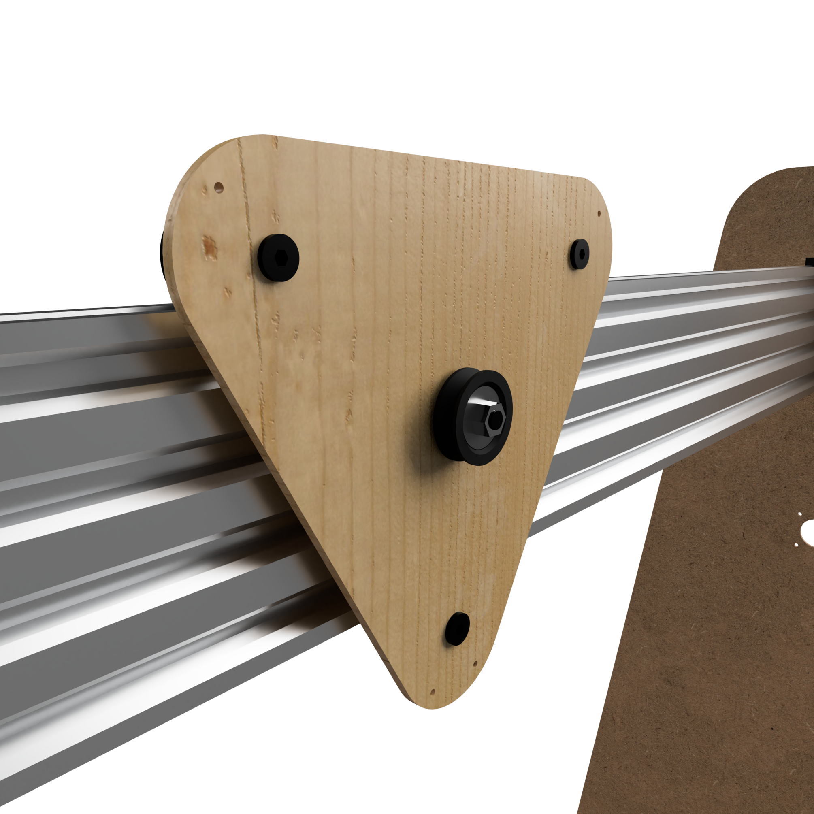 |
| --- | --- |

|   |  |
| --- | --- |

## Manufacturing

### 3D Printing

I created a new Fusion360 file and imported the 3D printed bodies from the main Fusion360 file. I then laid out all of the parts flat on the XZ plane before exporting the STL file.

I opened the STL file in Cura and sliced the file for my 3D printer. I saved the Gcode to the microSD card to transfer the file to the printer.

  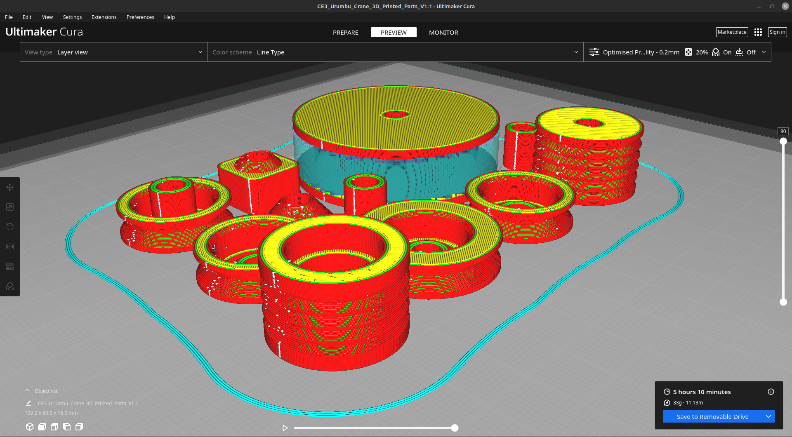

I printed the parts using black PLA filament.

  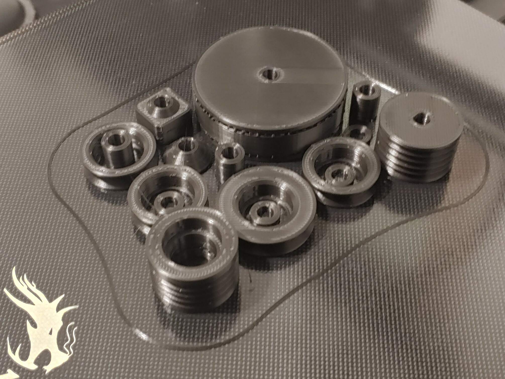

### CNC Routing

The MDF parts were imported into two new Fusion 360 designs, laid flat on the XZ plane and arranged to fit 8’x4’ sheets of MDF. Using the "Manufacturing" workspace, a new "Setup" was created, defining the type of CNC operation and the material properties. The "2D Pocket" and "2D Contour" operations were used to create the toolpaths.

|  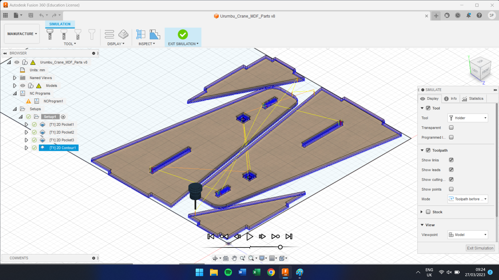 | 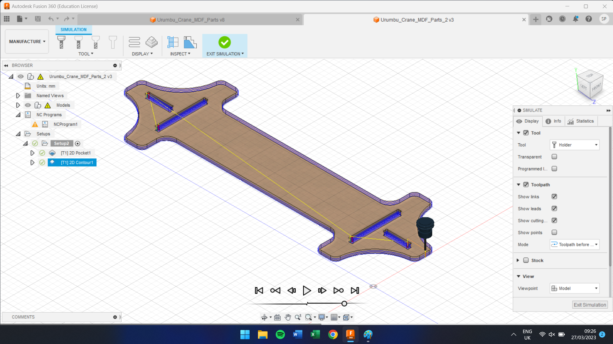 |
| --- | --- |

The toolpaths were exported as `.nc` files and saved to a USB stick. The USB stick was plugged into the large format CNC machine controller. The MDF was placed on the CNC, the vacuum table and extraction were turned on, the origins were set and the files were selected to cut.

|  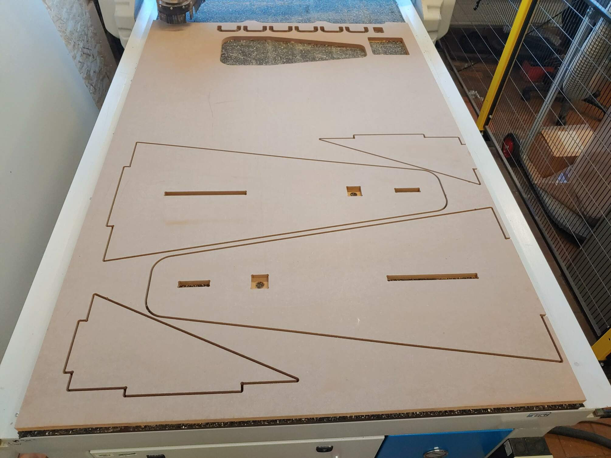 | 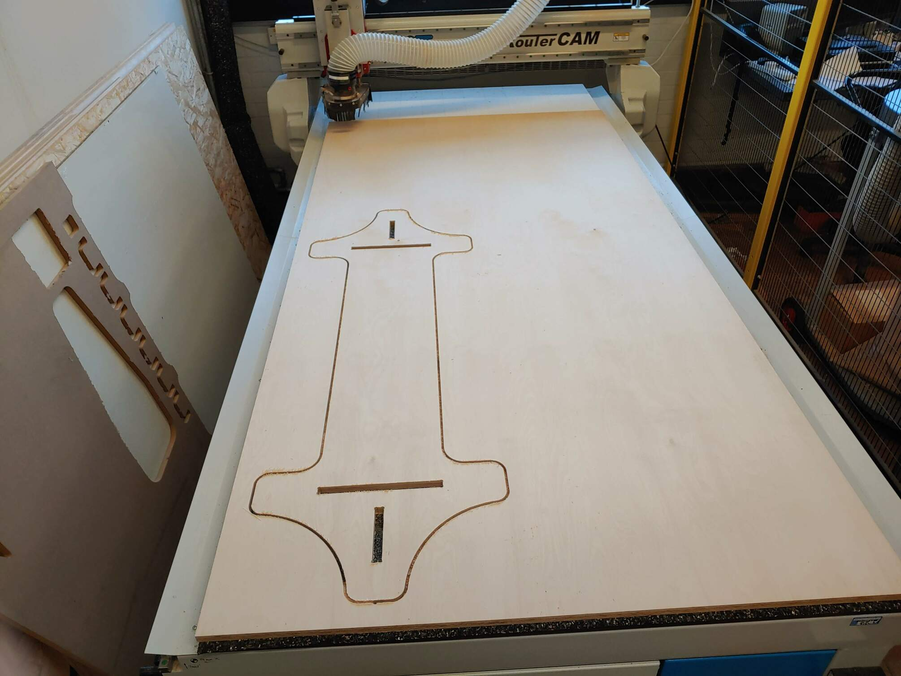 |
| --- | --- |

### Laser Cutting

Using the Fusion 360 app "Shaper", I created SVG images for all the profiles that needed laser cutting.

  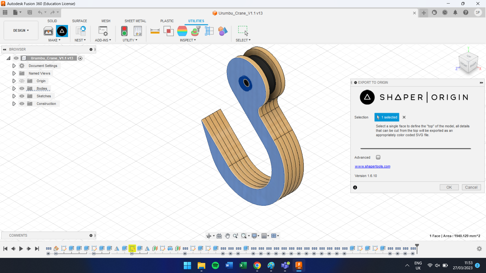

This created SVG images of the end plate, carriage, outer hook, inner hook and motor mount profiles.

These profiles were imported into Inkscape and altered to have a red outline with no fill. The profiles were arranged to best use the space.

  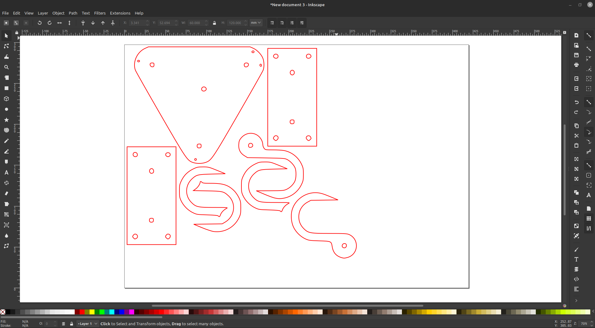

In CorelDRAW, all lines were set to hairline thickness, and the file was sent to "print" on the Trotec Speedy400 laser-cutter. This opened Trotec JobControl. 

The 3mm Plywood was placed on the bed of the laser cutter, the laser height and position were set, and the lid was closed. In JobControl, the file was dragged to the position of the laser and set to cut.

  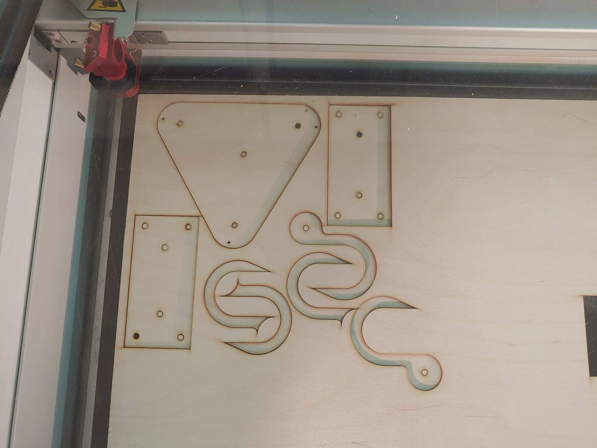

### Assembling

## Demonstration

## Conclusion