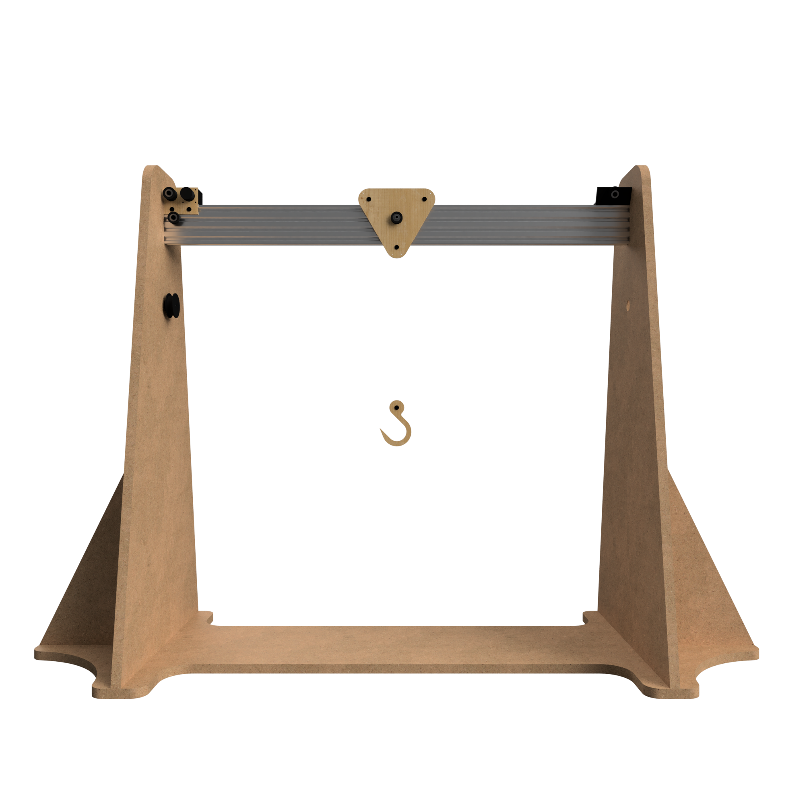

# Urumbu Crane

## Table of Contents <!-- omit from toc -->

- [Introduction](#introduction)
- [Design](#design)
  - [Y-Axis Drum](#y-axis-drum)
  - [X-Axis Drive Section](#x-axis-drive-section)
  - [X-Axis Carriage](#x-axis-carriage)
  - [Tail Pulley](#tail-pulley)
  - [Hook](#hook)
  - [End Plates](#end-plates)
  - [Frame](#frame)
- [Manufacturing](#manufacturing)
  - [3D Printing](#3d-printing)
  - [CNC Routing](#cnc-routing)
  - [Laser Cutting](#laser-cutting)
  - [Assembling](#assembling)
- [Software](#software)
- [Demonstration](#demonstration)
- [Conclusion](#conclusion)

## Introduction

I designed a set of Urumbu USB stepper motor modules for tudents in the FabLAB to rapidly prototype motion systems. I designed and built this crane to test and demonstrate the use of the modules I deseigned. This repository serves as a project for students to reference when they are learning how to use the modules.

## Design

  

### Y-Axis Drum

   

Design Features:
- Two holes to tie the fishing line to.
- Reels in the fishing line.
- Friction fits onto NEMA 14 motor D-shaft.

### X-Axis Drive Section

|   |  |
| --- | --- |

Design Features:
- Mounts the NEMA 14 motor to the aluminium extrusion.
- Secured to the aluminium extrusio using two M5 tee-nuts.
- Tensioner pulley for the fishing line to be wound in a figure-eight around both pulleys, increasing friction between the motor pulley and fishing line, preventing it from slipping.
- Tensioner pulley has two bearings to help the fishing line move smoothly.

### X-Axis Carriage

   

Design Features:
- Three M5 bolts secure spacers and Delrin v-wheels 
- The V-wheel slot into the v-slot linear rail allowing the carriage to glide smoothly along the axis.
- Two holes for tying the x-axis fishing line to.
- A central pulley, to allow the fishing line to run over it and down to the hook.
- Two holes for the y-axis fishing line to be tied to after goig through the hook. (There are two symmetrical holes to allow for the fihing line to come fro the left or right side of the crane)

### Tail Pulley

|   |  |
| --- | --- |

Design Features:
- 3D printed bracket to secure the pulley to the aluminium extrusion at an angle to match the angle of the fishing line allowing it to travel in a straight line from the motor pulley.
- Mounted to the extrusion with two M5 tee-nuts.

### Hook

   

Design Features:
- Made from 5 layers of laser cut 3mm plywood glued together.
- Includes a pulley for the fishing line to go through and back up to the carriage. The doubled-up line prevents the hook from easily spinning.

### End Plates

   

Design Features:
- Two central holes to secure the plates to the tapped holes in the aluminium extrusion using M5 bolts.
- Four corner holes to secure the plates to the MDF frame with self-tapping wood screws.  

### Frame

   

Design Features:
- Slot together with mortise and temon joints (dogboned to take into account the radius of the end mill)
- Symmetrical to allow the Y-axis motor to be mounted on either the left or right side.

## Manufacturing

### 3D Printing

I created a new Fusion360 file and imported the 3D printed bodies from the main Fusion360 file. I then laid out all of the parts flat on the XZ plane before exporting the STL file.

I opened the STL file in Cura and sliced the file for my 3D printer. I saved the Gcode to the microSD card to transfer the file to the printer.

  

I printed the parts using black PLA filament.

  

### CNC Routing

The MDF parts were imported into two new Fusion 360 designs, laid flat on the XZ plane and arranged to fit 8’x4’ sheets of MDF. Using the "Manufacturing" workspace, a new "Setup" was created, defining the type of CNC operation and the material properties. The "2D Pocket" and "2D Contour" operations were used to create the toolpaths.

|   |  |
| --- | --- |

The toolpaths were exported as `.nc` files and saved to a USB stick. The USB stick was plugged into the large format CNC machine controller. The MDF was placed on the CNC, the vacuum table and extraction were turned on, the origins were set and the files were selected to cut.

|   |  |
| --- | --- |

### Laser Cutting

Using the Fusion 360 app "Shaper", I created SVG images for all the profiles that needed laser cutting.

  

This created SVG images of the end plate, carriage, outer hook, inner hook and motor mount profiles.

These profiles were imported into Inkscape and altered to have a red outline with no fill. The profiles were arranged to best use the space.

  

In CorelDRAW, all lines were set to hairline thickness, and the file was sent to "print" on the Trotec Speedy400 laser-cutter. This opened Trotec JobControl. 

The 3mm Plywood was placed on the bed of the laser cutter, the laser height and position were set, and the lid was closed. In JobControl, the file was dragged to the position of the laser and set to cut.

  

### Assembling

- Slotted frame together.
- Tapped M5 threads into 80x20x1000mm aluminium extrusion ends.
- Bolted the end plates to the ends of the aluminium extrusion.
- Screwed the end plates to the frame.

|   |  |
| --- | --- |
  
- Glued the hook profiles together.
  

  

- Fixed both motors in place using M3 bolts.
- Covered the backs of both motors with electrical tape to prevent short circuits.
- Bolted Urumbu modules to the back of the motors using M3 bolts and several nylon washers.
- Plugged the stepper motor cables into the headers on the Urumbu boards.

|   |  |
| --- | --- |

- Press fitted the X-axis motor pulley and Y-axis drums onto the motor shafts.
- Secured the X-axis motor mount, tail pulley bracket and other parts to the aluminium extrusion using M5 bolts and tee-nuts.

|   |  |
| --- | --- |

- Secured the carriage pulley to the carriage using a spacer with an M5 nut and bolt.
- Bolted the top two Delrin v-wheels to the carriage with spacers along with M5 nuts and bolts.
- Placed the carriage on the extrusion with the top v-wheels slotted into the top v-slot.
- Held the third v-wheel in place underneath the extrusion and secured it to the carriage.

|   |  |
| --- | --- |

- Tied the fishing line to one side of the carriage.
- Wrapped the line around the X-axis motor pulley and tensioner pulley in a figure-eight.
- Looped the line around the tail pulley.
- Tied the line to the other side of the carriage.

  

- Tied a second piece of fishing line to the bottom of the carriage.
- Threaded the line through the hook pulley, over the carriage pulley and the second pulley.
- Tied the line to the Y-axis drum with enough slack for the hook to touch the floor at the far end of the X-axis travel.
- Wound the line up on the Y-axis drum.

  

The complete crane was assembled in less than three hours.

  

## Software

## Demonstration

## Conclusion